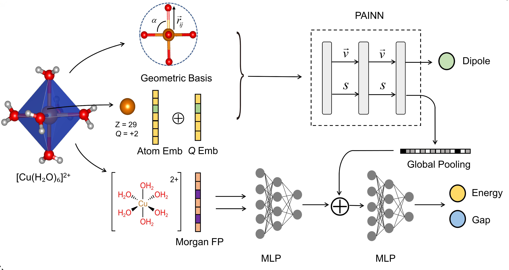

# CoordNet

<p align="center">
  
</p>

**CoordNet** is an E(3)-equivariant graph neural network for property prediction of transition metal coordination complexes. The model learns geometry-conditioned representations that capture electronic-structure signals under physical constraints, using only atomic numbers, 3D positions, and total molecular charge as inputs.

[](https://opensource.org/licenses/MIT)
[](https://www.python.org/downloads/)
[](https://pytorch.org/)

## Key Features

- **E(3)-equivariant representation**: Scalar targets are rotation/translation invariant; vector targets (e.g., dipole) transform equivariantly
- **Geometry-based encoding**: Infers electronic-structure–relevant observables from 3D structure without relying on heuristic chemical labels (e.g., oxidation states)
- **Electronic boundary condition**: Conditions on total molecular charge **Q** as a rigorous global invariant
- **Thermodynamic scaling**: Supports size-consistent learning/evaluation via per-atom normalization for extensive targets
- **Multi-task learning**: Simultaneous prediction of energy, HOMO–LUMO gap, dipole moment, and NPA charges

## Model Variants

| Variant | Description | Config |
|---------|-------------|--------|
| **CoordNet** (default) | Geometry-only model using (z, pos, Q) | `configs/paper.yaml` |
| CoordNet-Geo+FP | Ablation with Morgan fingerprint fusion | `configs/ablation_with_fp.yaml` |

> **Note**: The paper-style results reported in this repository use the default **geometry-only** model. The fingerprint-fusion variant is provided for ablation/engineering comparisons only.

## Installation

### Option 1: Conda (Recommended)

```bash
git clone https://github.com/1701NJU/CoordNet1.0.git
cd CoordNet1.0
conda env create -f environment.yml
conda activate coordnet
```

### Option 2: Pip

```bash
git clone https://github.com/1701NJU/CoordNet1.0.git
cd CoordNet1.0
pip install -r requirements.txt
```

### PyTorch Geometric Installation Notes

PyTorch Geometric requires matching CUDA/PyTorch versions. If installation fails:

```bash
# Find your PyTorch and CUDA versions
python -c "import torch; print(torch.__version__, torch.version.cuda)"

# Install matching PyG wheels (example for PyTorch 2.0 + CUDA 12.1)
pip install torch-scatter torch-sparse torch-geometric -f https://data.pyg.org/whl/torch-2.0.0+cu121.html
```

See the [PyG installation guide](https://pytorch-geometric.readthedocs.io/en/latest/install/installation.html) for details.

### Dependencies

- Python >= 3.10
- PyTorch >= 2.0
- PyTorch Geometric >= 2.4
- RDKit (optional; required only for the FP ablation or SMILES-derived preprocessing)

## Dataset

We use the [tmQM dataset](https://github.com/bbskjelern/tmQM) containing ~86,000 DFT-optimized transition metal complexes.

### Automatic Setup

```bash
python scripts/prepare_data.py --out_dir data
```

### Manual Setup

```bash
mkdir -p data/raw
cd data/raw
git clone https://github.com/bbskjelern/tmQM.git tmQM-master
```

Preprocessing takes 10–30 minutes (depending on hardware) and creates cached files under `data/processed/`.

## Training

### Paper-Style Reproduction

```bash
# Full reproduction pipeline
bash scripts/reproduce_paper.sh

# Or step by step:
python scripts/prepare_data.py --out_dir data
python scripts/train.py --config configs/paper.yaml
```

### Custom Training

```bash
python scripts/train.py --config configs/default.yaml
```

### Configuration

Key hyperparameters in `configs/paper.yaml`:

```yaml
model:
  hidden_dim: 128      # Feature dimension
  num_layers: 3        # Number of PaiNN layers
  cutoff: 5.0          # Neighbor cutoff (Å)
  use_fp: false        # Geometry-only (paper-style default)

training:
  batch_size: 32
  lr: 5.0e-4
  epochs: 300
  max_grad_norm: 10.0
```

## Model Performance

Results on the tmQM test set (random 80/10/10 split, seed=42, config = `configs/paper.yaml`):

| Property | MAE | Unit | Notes |
|----------|-----|------|-------|
| Electronic Energy | 6.2 | meV/atom | Total energy MAE normalized by atom count |
| HOMO–LUMO Gap | 0.27 | eV | (internally may be represented in Hartree) |
| Dipole Moment | 0.42 | D | MAE on dipole magnitude |

<details>
<summary>Additional reporting (click to expand)</summary>

| Property | MAE (total) | Unit | Notes |
|----------|-------------|------|-------|
| Electronic Energy | 0.31 | eV/molecule | Unnormalized total-energy MAE |
| HOMO–LUMO Gap | 0.27 (0.010) | eV (Hartree) | 1 Hartree = 27.2114 eV |

</details>

## Usage

### Inference

```python
import torch
from coordnet import CoordNet, AtomRefCalculator

# Load model
atom_ref = AtomRefCalculator().load('runs/best/atom_ref.npz')
model = CoordNet(atom_ref=atom_ref)
state = torch.load('runs/best/best_model.pt', map_location='cpu')
model.load_state_dict(state['model_state_dict'])
model.eval()

# Predict (batch: PyG Batch with z, pos, charge, batch)
with torch.no_grad():
    output = model(batch)

    # Total electronic energy (eV/molecule)
    energy = output['energy']          # shape: [B]

    # Gap (Hartree by default; convert to eV if needed)
    gap_h = output['gap']              # shape: [B]
    gap_ev = gap_h * 27.2114

    # Dipole magnitude (Debye)
    dipole = output['dipole']          # shape: [B]

    # NPA charges (per atom)
    npa = output['npa']                # shape: [N]
```

### Custom Data (Geometry-only)

CoordNet requires minimal input: atomic numbers, positions, and molecular charge.

```python
import torch
from torch_geometric.data import Data

data = Data(
    z=torch.tensor([26, 6, 7, 8], dtype=torch.long),     # Atomic numbers
    pos=torch.tensor([[0., 0., 0.], [1., 0., 0.], [0., 1., 0.], [0., 0., 1.]]),  # Å
    charge=torch.tensor([0.0]),                           # Total molecular charge
    batch=torch.zeros(4, dtype=torch.long)               # Batch indices
)
```

## Architecture

CoordNet uses PaiNN-style E(3)-equivariant message passing as building blocks, with dual conditioning on atomic number (Z) and global molecular charge (Q). Scalar targets (energy, gap) are rotation/translation invariant; the dipole magnitude is computed via equivariant pooling.

| Component | Description |
|-----------|-------------|
| `DualEmbedding` | Atom (Z) + charge (Q) embedding |
| `RadialBasisFunctions` | Gaussian RBF distance encoding |
| `PaiNNLayer` | E(3)-equivariant message passing |
| `EnergyHead` / `GapHead` | Scalar property prediction (invariant) |
| `DipoleHead` | Dipole magnitude via equivariant vector pooling |

For full update equations, see [`docs/method.md`](docs/method.md).

### Atom Reference Correction

Energy prediction uses per-element reference energies fitted on training data, enabling size-consistent predictions:

$$E_{\text{pred}} = E_{\text{NN}} + \sum_i E_{\text{ref}}(Z_i)$$

## Pretrained Checkpoints

Pretrained model weights will be released upon publication.

<!-- 
After publication, update this section:
| Checkpoint | Config | Test MAE (Energy) | Download |
|------------|--------|-------------------|----------|
| CoordNet-v1.0 | paper.yaml | 6.2 meV/atom | [Link]() |
-->

## Citation

If you use this code in your research, please cite the repository:

```bibtex
@software{coordnet_repo_2026,
  title   = {CoordNet1.0},
  author  = {Luo Wenlin,Li Chenghui,Jiang ZeFeng},
  year    = {2026},
  url     = {https://github.com/1701NJU/CoordNet1.0},
  note    = {Code for an E(3)-equivariant model for coordination complexes. Manuscript in preparation.}
}
```

> **Manuscript status**: This repository accompanies an unpublished manuscript (not yet accepted). The citation will be updated upon publication.

## Contact

- **Author**: Wenlin Luo. ZeFeng Jiang.
- **Email**: luowenlin862@gmail.com pploveqbb@gmail.com
- **Issues**: [GitHub Issues](https://github.com/1701NJU/CoordNet1.0/issues)

## License

This project is licensed under the MIT License - see the [LICENSE](LICENSE) file for details.

## Acknowledgments

- [PaiNN](https://github.com/atomistic-machine-learning/schnetpack)-style equivariant message passing (building blocks)
- [tmQM dataset](https://github.com/bbskjelern/tmQM)
- [PyTorch Geometric](https://pytorch-geometric.readthedocs.io/)
